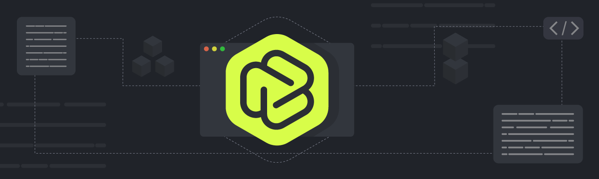

# Blockless HTTP Extension



The HTTP extension is written in Go. The extension also supports rust, c/c++, among other languages.

## How to build
```
$ go build -buildmode=c-shared -ldflags "-s -w" -o http_driver.so  
```
